### WELCOME

  

---

### 🌐 Statut du Système
> "Le monde numérique... J'ai essayé de l'imaginer. Des amas d'informations voyageant à travers l'ordinateur." — *Kevin Flynn*

| Module | Statut | Niveau de Sécurité |
| :--- | :---: | :--- |
| **Interface Utilisateur** | En ligne | 🟢 Optimal |
| **Base de Données Projets** | Synchronisation... | 🟢 Synchronisé |
| **IA & Robotique** | Actif | 🔵 Haute Priorité |

---

### 🛠️ Arsenal Technologique

  
  
  
  
  
  
  
  
  
  
  
  
  
  
  
  
  
  
  
  
  
  

---

### 🚀 Projets en cours de Compilation
1.  **[ros2_drone_slam](https://github.com/1st-adambenjabbar/ros2_drone_slam)** : Implémentation de SLAM pour drones sous ROS2.
2.  **[IsaacLab](https://github.com/1st-adambenjabbar/IsaacLab)** : Framework unifié pour l'apprentissage robotique sur NVIDIA Isaac Sim.
3.  **[costum-memory-allocator](https://github.com/1st-adambenjabbar/costum-memory-allocator)** : Développement d'un allocateur de mémoire personnalisé haute performance.
4.  **[gazebo_uav_control](https://github.com/1st-adambenjabbar/gazebo_uav_control)** : Contrôle PID pour drones quadrirotors dans Gazebo avec C++.
5.  **[tic-vla](https://github.com/1st-adambenjabbar/tic-vla)** : Exploration et développement de modèles Vision-Language-Action.

---

### 📡 Transmission Entrante
Si vous souhaitez collaborer ou explorer la Grille ensemble, envoyez un signal.

  

  
  

