# 🤖 Système Initialisé : Profil Cybernétique Tron

  

---

### 🌐 Statut du Système
> "Le monde numérique... J'ai essayé de l'imaginer. Des amas d'informations voyageant à travers l'ordinateur." — *Kevin Flynn*

| Module | Statut | Niveau de Sécurité |
| :--- | :---: | :--- |
| **Interface Utilisateur** | En ligne | 🟢 Optimal |
| **Base de Données Projets** | Synchronisation... | 🟡 En cours |
| **IA & Robotique** | Actif | 🔵 Haute Priorité |

---

### 🛠️ Arsenal Technologique

  
  
  
  
  

---

### 🚀 Projets en cours de Compilation
1.  **Projet Argon** : Optimisation des flux de données neuronales.
2.  **Sentinelle Cyber** : Système de défense robotique autonome.
3.  **Grille V2** : Refonte de l'écosystème numérique.

---

### 📡 Transmission Entrante
Si vous souhaitez collaborer ou explorer la Grille ensemble, envoyez un signal.

  

  
  

---

  <i>Généré par Manus AI - Mai 2026</i>

